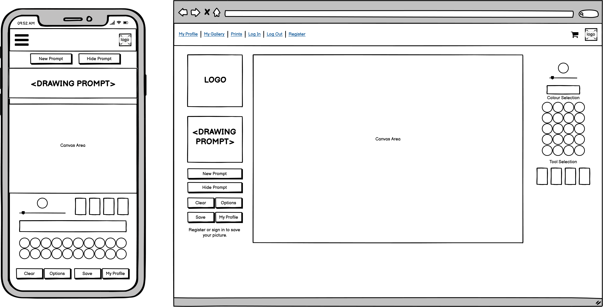
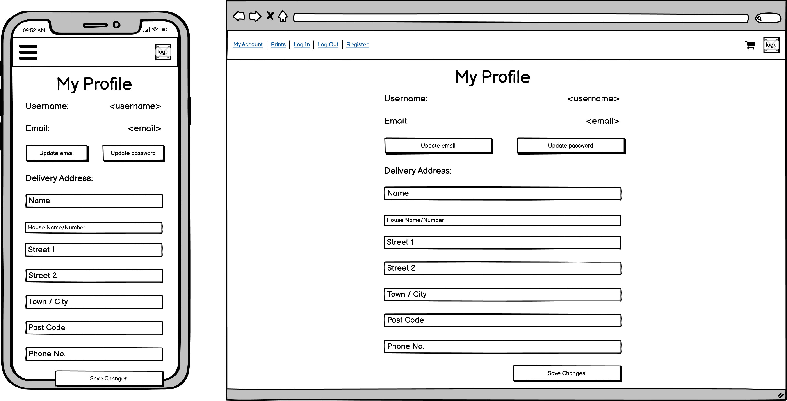
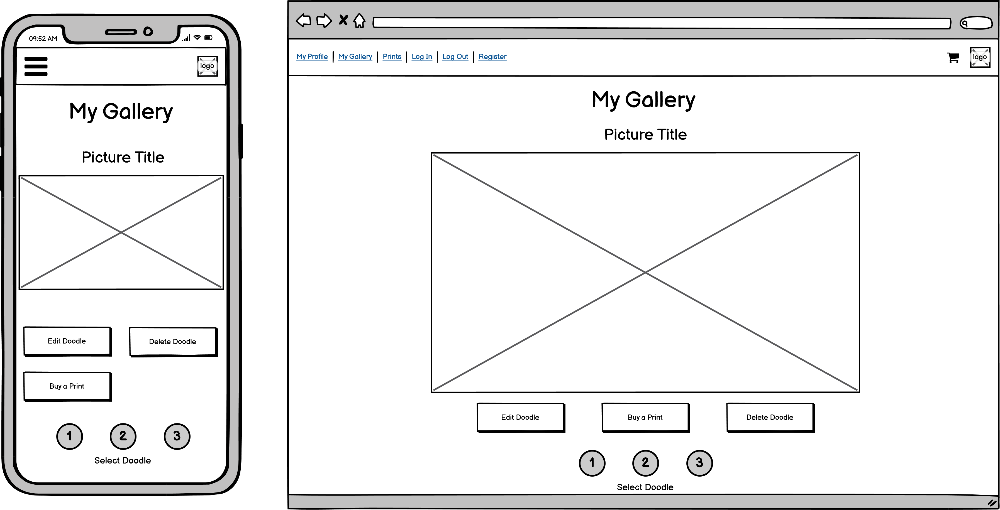
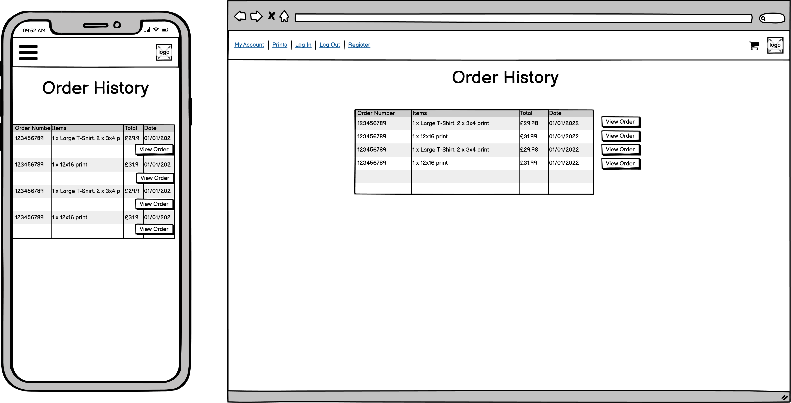
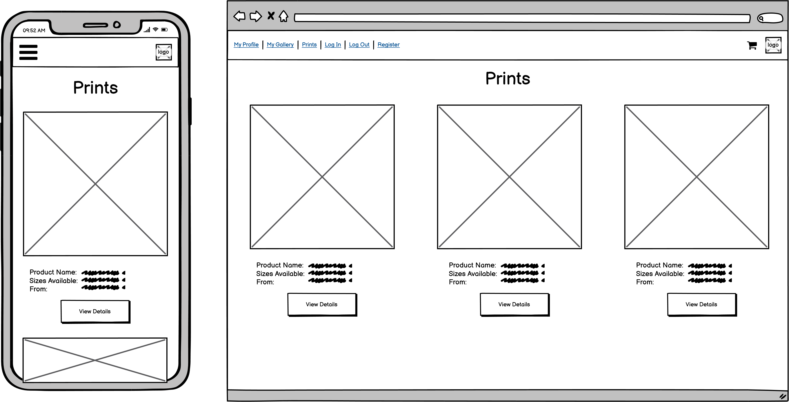
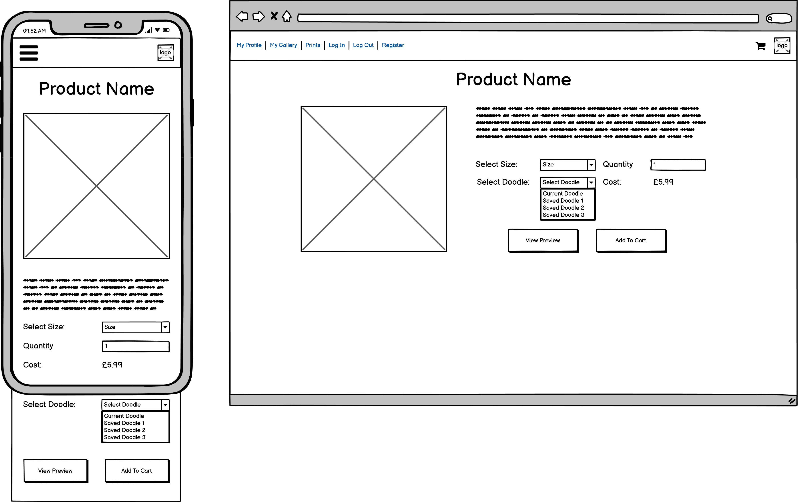

# Doodle This

***

## User Experience

### User Stories

#### New User Stories

* As a new user I want to be able to quickly understand the purpose of the site so that I can decide if it provides value to me
* As a new user I want to be able to quickly understand how to use the application so that I can start using it to create art
* As a new user I want to be able to know where to look for help so that I can find answers to my questions
* As a new user I want to be able to easily sign up for an account so that I can store my details and save my artwork

#### Registered User Stories

* As a registered user I want to be able to easily log in to or out of my account so that I can access the data I've stored
* As a registered user I want to be able to save my drawings so that I can access them later
* As a registered user I want to be able to edit my saved drawings so that I can make changes to them after they're saved
* As a registered user I want to be able to delete my saved drawings so that I can get rid of old drawings and make space for new ones
* As a registered user I want to be able to save my shipping details so that I can checkout more quickly in future

#### Drawing App User Stories

* As a drawing app user I want to be able to use a selection of basic drawing tools so that I can create drawings
* As a drawing app user I want to be able to select from a number of preset colours so that I can quickly create art with a balanced palette
* As a drawing app user I want to be able to use custom colours so that I can draw with any colour I want
* As a drawing app user I want to be able to generate random drawing prompts so that I can quickly get ideas about what to draw
  
#### Shopper User Stories

* As a shopper I want to be able to purchase products printed with my drawing so that I can own or gift a physical copy of my drawing
* As a shopper I want to be able to view the products available to purchase so that I can decide if there are any I'd like to buy
* As a shopper I want to be able to view product details so that I can find out more about the product and any variants available
* As a shopper I want to be able to view a preview of my drawing on a product so that I can get an idea of how my artwork would look when printed
* As a shopper I want to be able to easily manage my shopping cart so that I can select the products I want and see the costs
* As a shopper I want to be able to easily checkout and pay for my order so that I can purchase the products I want 

### Design

#### Colours and Shades

#### Typography

#### Imagery

### Wireframes

| Page          | Wireframe                                                     |
|---------------|---------------------------------------------------------------|
| Sketchbook    |     |
| My Profile    |     |
| My Gallery    |     |
| Order History |  |
| Prints        |         |
| Product       |   |

***

## Features

***

## Database Design

***

## Future Features

***

## Technologies

### Languages Used

### Frameworks, Libraries & Programs Used

***

## Testing

Please see [TESTING.md](TESTING.md) for details of tests performed and bugs fixed.

***

## Deployment

## Other Credits and Acknowledgements
